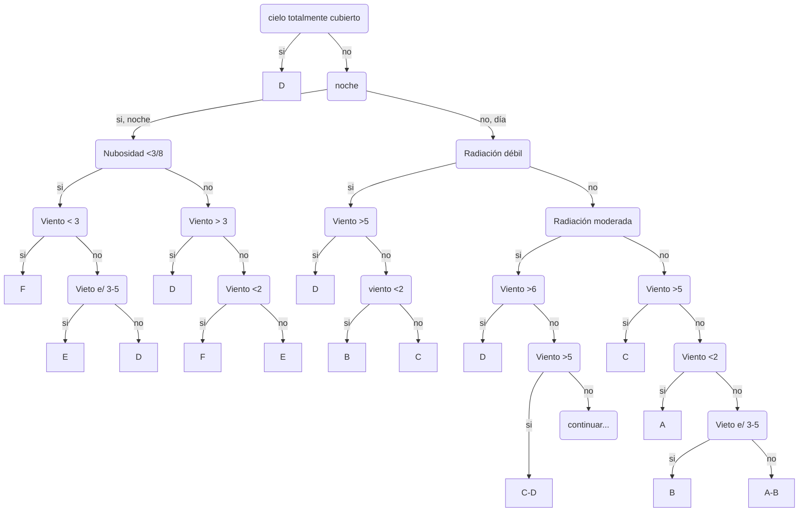
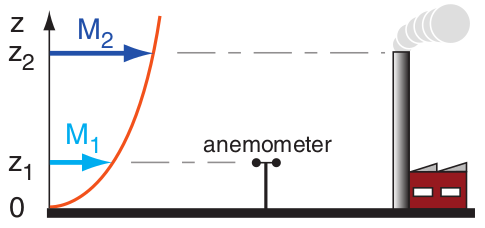

# Meteorología

Repaso de temas de meteorología aplicada al trensporte de contaminantes.
{: .fs-6 .fw-300 }

<!--center><iframe width="400" height="225"
src="https://www.youtube.com/embed/MUQfKFzIOeU" 
frameborder="0" 
allow="accelerometer; autoplay; encrypted-media; gyroscope; picture-in-picture" 
allowfullscreen>
</iframe></center-->

## Resumen

La región de la atmósfera que nos interesa especialmente para la modelación de contaminantes se conoce como **capa límite planetaria** (CLP) y abarca los primeros 1-4 km de espesor desde la superficie terrestre. En particular, nos van a interesar los procesos que ocurren en la *microescala*, estos se definen como procesos que tienen una escala espacial menor a 1km y que responden a forzantes en un tiempo del orden de 1 hora.

### Capa límite Planetaria (CLP)

Es la capa de la atmósfera influenciada por la superficie terrestre, y podemos subdividirla en:
+ *capa de mezcla*: es la región superior de la CLP, donde la turbulencia es tal que podemos asumir que está mezclada completamente.
+ *capa superficial* (100-400m) zona donde la velocidad del viento es influenciada por los elementos de la superficie.

La capa límite responde a los flujos de calor sensible y latente entre la superficie terrestre y el aire a lo largo del día, modificando su espesor y el grado su grado de turbulencia.

La turbulencia va a afectar de forma significante el nivel de mezcla que sufran los contaminantes una vez emitidos y por lo tanto es importante su estudio. Un concepto ligado a la turbulencia en la atmósfera es el de *estabilidad*, y es lo que desarrollaremos en la siguiente seccción.

### Estabilidad atmosférica

La estabilidad hace referencia a como responde un sistema en determinado estado cuando es perturbado.

Decimos que un sistema es *estable* cuando al ser perturbado retorna a su estado inicial. Decimos que un sistema es *neutro* si al ser perturbado adopta el estado nuevo provocado por dicha perturbación, y decimos que un sistema es *inestable* si este al ser perturbado se acelera en la dirección de la perturbación.

En la atmósfera el concepto de estabilidad puede aplicarse a como se acelera verticalmente un volumen de aire cuando es perturbado por causas como la turbulencia. Y por lo tanto, nos da una idea de la "libertad" con la que las masas de aire pueden moverse verticalmente.

A continuación vamos a definir dos magnitudes que nos van a permitir diagnósticar si la atmósfera es estable ó no.

#### Gradiente adiabático seco (&Gamma;)
El gradiente adiabático seco no dice cuanto se modifica la temperatura de una parcela de aire seca cuando aciende verticalmente de forma adiabática (sin intercambiar calor con el entorno):

  &Gamma; = -dT / dz 

De forma teórica (utilizando la primer ley de la temrodinámica y la ecuación de los gases ideales) se puede demostrar que &Gamma;=g/cp = -9.8 ºC/km.

#### Gradiente adiabático real (&Lambda;)

Generalmente el perfil de Temperaturas en la capa límite posee un gradiente de temperatura que se aparta de &Gamma;. Esto se debe a la transferencia de calor que ocurre entre la superficie terrestre y la atmósfera.

#### Critério de estabilidad
Llamemos &Lambda; al gradiente adiabático real (observado), luego diremos que:

+ La atmosféra es   estable &nbsp;&nbsp;       si &Lambda; < &Gamma;
+ La atmosféra es    neutra &nbsp;&nbsp;&nbsp; si &Lambda; = &Gamma;
+ La atmosféra es inestable                    si &Lambda; > &Gamma;

Con esto ya sabemos como identificar y diagnosticar la estabilidad de la atmósfera. Como fue mencionado &Lambda; esta vinculado a el balance radiativo entre la superficie terrestre y la atmósfera.

### Balance radiativo en la CLP

La radiación neta (Rn) que absorbida por la superficie terrestre puede transformarse en:
- flujo de calor sensible (H) hacia la atmósfera. 
- flujo de calor latente  (&lambda E) hacia la atmósfera. 
- flujo de calor hacia el suelo.

Rn = H + &lambda;E + G 

El flujo de calor que nos interesa es H dado que es el calor que va a producir un cambio de temperatura en la atmósfera, y por lo tanto va a determinar la estabilidad.

Podemos decir que en general:
+ **H < 0**  Hay un flujo de calor sensible desde la atmósfera a la superficie y decmios que hay condiciones ESTABLES.
+ **H = 0**  No hay flujo neto de calor sensible entre la atmósfera y la superifice, decimos que hay condiciones NEUTRAS.
+ **H > 0**  Hay un flujo de calor sensible desde el suelo a la atmósfera, decimos que hay condiciones INESTABLES.

#### Clases de estabilidad

Definidas por Pasquill (1961), permite definir a partir de información facilmente disponible, una clase probable de estabilidad atmosférica y luego a partir del aporte de Gifford (1961) se pudieron determinar coeficientes de dispersión (&sigma;) por turbulencia asociados a cada clase.

<table>
<tbody>
<tr>
    <td rowspan=3>Velocidad del viento a 10m [m/s]</td>
    <td colspan=3>Día</td>
    <td rowspan=2 colspan=2>Noche</td>
</tr>
<tr>
  <td colspan=3>Radiación solar incidente</td>
</tr>   
<tr>
  <td> Fuerte (mayor que 50 cal/cm2 h)</td>
  <td> Moderada (entre 25 y 50 cal/cm2 h)</td>
  <td> Débil (mayor que 50 cal/cm2 h)</td>
  <td> Cubierto entre 4/8 y 7/8</td>
  <td> Despejado o < 3/8 </td>
</tr>
<tr>
  <td><2</td>
  <td>A</td>
  <td>A-B</td>
  <td>B</td>
  <td>F</td>
  <td>F</td>
</tr>
   <tr>
  <td>2-3</td>
  <td>A-B</td>
  <td>B</td>
  <td>C</td>
  <td>E</td>
  <td>F</td>
</tr>
   <tr>
  <td>3-5</td>
  <td>B</td>
  <td>B-C</td>
  <td>C</td>
  <td>D</td>
  <td>E</td>
</tr>
   <tr>
  <td>5-6</td>
  <td>C</td>
  <td>C-D</td>
  <td>D</td>
  <td>D</td>
  <td>D</td>
</tr>
   <tr>
  <td> >6 </td>
  <td>C</td>
  <td>D</td>
  <td>D</td>
  <td>D</td>
  <td>D</td>
</tr>
</tbody>  
</table>

Criterio para seleccionar clase de estabilidad según Pasquill:

### Similitud 

Se ha encontrado empiricamente que los perfiles de viento en la capa sueperficial son similares unos con otros cuando son escalados con parametros de longitud y velocidad apropiados, este método es conocido como *teoría de similitud*.

#### Perfil de velocidades en la capa límite:

El perfil de velocidades de viento en la capa límite, bajo condiciones neutras y terreno rugoso, se puede calcular como:

  $$
  u(z)= \dfrac{u_*}{\kappa} \ln \bigg( \dfrac{z}{z_0}\bigg) 
  $$

donde $z0$ es un coeficiente que sirve como medida de la rugosidad del terreno.

El perfil de vientos es fuertemente dependiente de la estabilidad atmosférica, y bajo condiciones estables ó inestables la fórmula anterior necesita ser corregida.

bajo condiciones estables el perfil de velocidades puede calcularse mediante la siguiente expresión:

  $$
  u = \dfrac{u_*}{k} \bigg( \ln \frac{z}{z_0} + 5 \dfrac{z-z_0}{L} \bigg)
  $$
 
donde $L$ es la longitud de Monin-Obukhov cuya expresión es:
	
  $$
  L = \dfrac{-\rho\,c_p\,T_a \, u^3_*}{g\,\kappa\,H} 
  $$

Para condiciones inestables, no hay una fórumla exacta, pero se puede aproximar iterativamente utilizando la siguiente expresión:

 $$
 u= \dfrac{u_*}{\kappa} \bigg\{  \ln \frac{z}{z_0} + \ln \bigg[\dfrac{(n_0^2 + 1) \,(n_0 +1)^2}{(n^2 + 1) \,(n +1)^2} \bigg] + 2 [\arctan n - \arctan n_0 ]\bigg\}
 $$

donde $n_0=(1-16z_0/L)^{1/4}$  y $n=(1-16z/L)^{1/4}$}

#### Perfil de temperatura en la capa límite:

  $$
  \theta_* = - \dfrac{H}{\rho c_p u_*} 
  $$

  $$ 
  \theta_* = 0.09 (1 -0.5 n^2) 
  $$

### Alturas de Mezcla

#### Altura de mezcla mecánica
Considerando el mezclado turbulento mecánico:

En condiciones neutrales:

  $$ 
  h_{\text{mix}}=\dfrac{0.3 u_*}{|f|} 
  $$

En condiciones estables:
  $$
  h_{\text{mix}}=C\sqrt{\dfrac{ u_* L}{|f|}  } 
  $$
    

Bajo condiciones inestables, $h_{\text{mix}}$ esta principalmente determinada por \alert{mezclado térmico}:

#### Altura de mezcla convectiva
En condiciones inestables:

  $$
  h_{\text{mix}}\approx D\sqrt{\dfrac{ u^3_*}{|f|^3L}  } 
  $$
 

### Turbulencia

El viento puede ser muy variable. Es útil pensar al viento como la superposición de tres tipos de flujos:
+ viento principal, relativamente constante y poco cambiante con el tiempo.
+ ondas: oscilaciones regulares (lineales) del viento en periodos de 10 minutos o más.
+ turbulencia: variaciones irregulares, casi aleatorias y no lineales en duraciones de segundos a minutos.

Estos flujos pueden ocurrir separadamente o combinados. 

#### Descomposición de Reynolds:

  $$
  u= \overline{u} + u' 
  $$

#### Medidas de Turbulencia:

Hay varias formas de cuantificar la turbulencia, algunas de las más fundamentales son la *variancia* de la velocidad del viento $\sigma_u \, \sigma_v\, \sigma_w$:

  $$
  \sigma_u^2 = \overline{u'^2} \qquad \sigma_v^2 = \overline{v'^2} \qquad \sigma_w^2 = \overline{w'^2} 
  $$

#### Turbulencia y Similitud:

En condiciones neutras y estables:

  $$
  \dfrac{\sigma_u}{u_*} = 2.5 \bigg( 1 - \dfrac{z}{h_{\text{mix}}}\bigg)^a
  $$
  
  $$
  \dfrac{\sigma_v}{u_*} = 1.9 \bigg( 1 - \dfrac{z}{h_{\text{mix}}}\bigg)^a 
  $$
  
  $$
  \dfrac{\sigma_w}{u_*} = 1.3 \bigg( 1 - \dfrac{z}{h_{\text{mix}}}\bigg)^a 
  $$

En condiciones inestables, se define una nueva velocidad de escala *velocidad convectiva* ($w_*$) :

  $$
   w_* = \bigg( \dfrac{g\,z_i\,H}{c_p\,\rho\,\theta} \bigg) 
  $$

  $$
   w_* = \bigg( \dfrac{h_{\text{mix}}}{L\kappa}\bigg)^{1/3} 
  $$

## Ejercicios

1) En un dia nublado, se midió una velocidad de 5 m/s a 10m  sobre el nivel del suelo con un anemometro. Cual es la velocidad del viento en el tope de una chimenea de 25m? Use 0.5m como coeficiente de rugosidad.

<!-- De stull chap 18 PBL, pag 702:
respuesta: 6.53 m/s
M2= M1 [ ln( h2/z0  ) / ln( h1/z0  ) ]
  = 5  [ ln(25m/0.5m) / ln(10m/0.5m) ] = 6.53
--> 

2) Calcule el perfil de vientos si u10 = 5 m/s , H = 200 W/m2 , z0 = 0.5 m, T0 = 300 K, y p0 = 101 kPa.

<!-- De DeVisscher chap 5, pag 89:
respuesta: u*=0.711 m/s y L=−162.3 m
Primero notar que H>0 => condicion inestable. Hay que resolver por el método iterativo, usando:
1st guess: u* =u *k /log(z/z0)   &  L  = rho*T*u*^3 / k*g*H
2nd guess:
	n0= (1-16*z0/L)^(1/4)  
	n = (1-16*z /L)^(1/4)  
	u* =u *k / log(z/z0)  + log ( (n^2-1)*(n-1)^2/( (n^2-1)*(n-1)^2 ) + 2*arctan(n)-arctan(n0)
	L  = rho*T*u*^3 / k*g*H
3rd guess ...:
Luego de algunas iteraciones se llega a u* y L y con eso se puede generar el perfil de velocidades:
u= u*/k * log(z/z0)   
-->

3) Calcular el flujo de calor sensible (H) para un dia nublado, si el angulo de elevación solar es 60° sobre el horizonte. Considere terreno rural y albedo 0.2. El CG=0.1, y el ratio de Bowen 0.5. Como cambiaria el calor sensible durante una inundación severa, si B sube a 1.5?
<!--
Solution. Equation (5.54) is used to calculate the solar radiation R. With n = 0 and
sin j = 3 0.5 /2, a value of 827.4 W m 2 is obtained.
Next, eq. (5.55) is used to calculate the net radiation R N . A value of 524.0 W m –2 is
obtained.
-->

## Bibliografía:
- "Practical Meteorology: An Algebra-based Survey of Atmospheric Science". Stull Rolland. AVP International, University of British Columbia, 2016.
- Pasquill,  F.,  1961:  The  estimation  of  the  dispersion  of  windbornematerial.Meteor. Mag.,90,33–49.
- Gifford, F. A., Use of Routine Meteorological Observations for Estimating Atmospheric Dispersion, Nuclear Safety, Vol. 2, 47-57 (1961).
