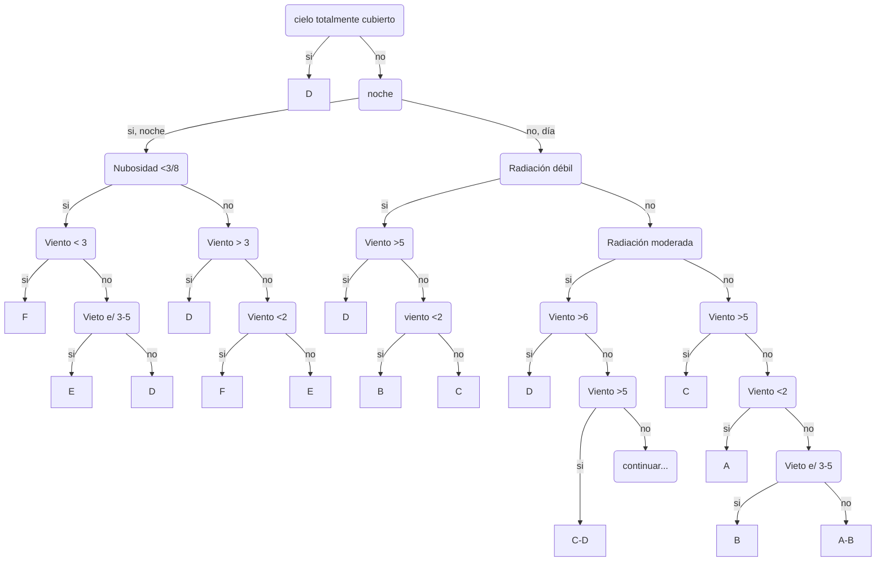

# Meteorología

Repaso de temas de meteorología aplicada al trensporte de contaminantes.
{: .fs-6 .fw-300 }

<!--center><iframe width="400" height="225"
src="https://www.youtube.com/embed/MUQfKFzIOeU" 
frameborder="0" 
allow="accelerometer; autoplay; encrypted-media; gyroscope; picture-in-picture" 
allowfullscreen>
</iframe></center-->

## Resumen

La región de la atmósfera que nos interesa especialmente para la modelación de contaminantes se conoce como **capa límite planetaria** (CLP) y abarca los primeros 1-4 km de espesor desde la superficie terrestre. En particular, nos van a interesar los procesos que ocurren en la *microescala*, estos se definen como procesos que tienen una escala espacial menor a 1km y que responden a forzantes en un tiempo del orden de 1 hora.

### Capa límite Planetaria (CLP)
Es la capa de la atmósfera influenciada por la superficie terrestre, y podemos subdividirla en:
+ *capa de mezcla*: es la región superior de la CLP, donde la turbulencia es tal que podemos asumir que hay mezcla completa.
+ *capa superficial* (100-400m) zona donde la velocidad del viento es influenciada por los elementos de la superficie.

La capa límite responde a los flujos de calor sensible y latente entre la superficie terrestre y el aire a lo largo del día.

### Balance radiativo en la CLP

Rn = H + &lambda;E + G 

donde: Rn es la radiación neta, H esel flujo de calor sensible y &lambda;E es el flujo de calor latente y G es el flujo de calor del suelo.

### Gradiente adiabático seco (&Gamma;)
El gradiente adiabático seco no dice cuanto se modifica la temperatura de una parcela de aire seca cuando aciende verticalmente de forma adiabática:

  &Gamma; = -dT / dz 

De forma teórica (utilizando la primer ley de la temrodinámica y la ecuación de los gases ideales) se puede demostrar que &Gamma;=g/cp = -9.8 ºC/km.

### Temperatura Potencial (&theta;)
Definimos temperatura potencial (&theta;) como la temperatura que tendría una parcela de aire seca si fuese llevada a una presión de referencia (1000hPa) de forma adiabática, y puede calcularse como:

\[ \theta = T \bigg( \dfrac{p0}{p} \bigg)^{R/c_p M} \]

### Estabilidad atmosférica

La estabilidad nos dice cuál es la tendencia de un volumen de aire a acelerarse en el sentido vertical cuando esté es perturbado. Y por lo tanto nos da una idea de la libertad con la que las masas de aire pueden moverse verticalmente.

Llamemos &Lambda; al gradiente adiabático real (observado), luego diremos que:

+ La atmosféra es   estable &nbsp;&nbsp;       si &Lambda; < &Gamma;
+ La atmosféra es    neutra &nbsp;&nbsp;&nbsp; si &Lambda; = &Gamma;
+ La atmosféra es inestable                    si &Lambda; > &Gamma;

#### Clases de estabilidad

Definidas por Pasquill (1961), permite definir a partir de información facilmente disponible, una clase probable de estabilidad atmosférica y luego a partir del aporte de Gifford (1961) se pudieron determinar coeficientes de dispersión (&sigma;) por turbulencia asociados a cada clase.

<table>
<tbody>
<tr>
    <td rowspan=3>Velocidad del viento a 10m [m/s]</td>
    <td colspan=3>Día</td>
    <td rowspan=2 colspan=2>Noche</td>
</tr>
<tr>
  <td colspan=3>Radiación solar incidente</td>
</tr>   
<tr>
  <td> Fuerte (mayor que 50 cal/cm2 h)</td>
  <td> Moderada (entre 25 y 50 cal/cm2 h)</td>
  <td> Débil (mayor que 50 cal/cm2 h)</td>
  <td> Cubierto entre 4/8 y 7/8</td>
  <td> Despejado o < 3/8 </td>
</tr>
<tr>
  <td><2</td>
  <td>A</td>
  <td>A-B</td>
  <td>B</td>
  <td>F</td>
  <td>F</td>
</tr>
   <tr>
  <td>2-3</td>
  <td>A-B</td>
  <td>B</td>
  <td>C</td>
  <td>E</td>
  <td>F</td>
</tr>
   <tr>
  <td>3-5</td>
  <td>B</td>
  <td>B-C</td>
  <td>C</td>
  <td>D</td>
  <td>E</td>
</tr>
   <tr>
  <td>5-6</td>
  <td>C</td>
  <td>C-D</td>
  <td>D</td>
  <td>D</td>
  <td>D</td>
</tr>
   <tr>
  <td> >6 </td>
  <td>C</td>
  <td>D</td>
  <td>D</td>
  <td>D</td>
  <td>D</td>
</tr>
</tbody>  
</table>

Criterio para seleccionar clase de estabilidad según Pasquill:

### Similitud 

Se ha encontrado empiricamente que los perfiles de viento en la capa sueperficial son similares unos con otros cuando son escalados con parametros de longitud y velocidad apropiados, este método es conocido como *teoría de similitud*.

#### velocidad de fricción (u*)

#### coeficiente de rugosidad (z0)

#### longitud de Monin-Obukhov (L)

### Turbulencia
El viento puede ser muy variable. Es útil pensar al viento como la superposición de tres tipos de flujos:
+ viento principal, relativamente constante y poco cambiante con el tiempo.
+ ondas: oscilaciones regulares (lineales) del viento en periodos de 10 minutos o más.
+ turbulencia: variaciones irregulares, casi aleatorias y no lineales en duraciones de segundos a minutos.

Estos flujos pueden ocurrir separadamente o combinados. 

### Perfil de vientos:

#### En condiciones neutras:

En condiciones neutras, el perfil de viento sigue un patro logarítmico:

\[ U(z) = \frac{u^*}{k} \ln \bigg( \dfrac{z}{z0} \bigg) \]

#### En condiciones estables:

En condiciones estables el perfil de vientos es logaritmico-lineal:

\[ U(z) = \frac{u^*}{k} \ln \bigg( \dfrac{z}{z0} \bigg) + 6\dfrac{z}{L} \]

donde $L$ es la longitud de Obukhov, definida como:

\[ L = \dfrac{-ur_*P^3}{k}, (g/T_v)\, F_{Hsfc}}\]

#### En condiciones inestables/convectivas:

## Ejercicios

1) En un dia nublado, se midió una velocidad de 5 m/s a 10m  sobre el nivel del suelo con un anemometro. Cual es la velocidad del viento en el tope de una chimenea de 25m? Use 0.5m como coeficiente de rugosidad.

<!-- De stull chap 18 PBL:
respuesta: 6.53 m/s
M2= M1 [ ln( h2/z0  ) / ln( h1/z0  ) ]
  = 5  [ ln(25m/0.5m) / ln(10m/0.5m) ] = 6.53
-->

## Bibliografía:
- "Practical Meteorology: An Algebra-based Survey of Atmospheric Science". Stull Rolland. AVP International, University of British Columbia, 2016.
- Pasquill,  F.,  1961:  The  estimation  of  the  dispersion  of  windbornematerial.Meteor. Mag.,90,33–49.
- Gifford, F. A., Use of Routine Meteorological Observations for Estimating Atmospheric Dispersion, Nuclear Safety, Vol. 2, 47-57 (1961).
