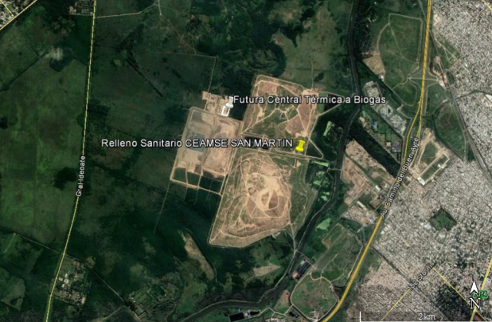
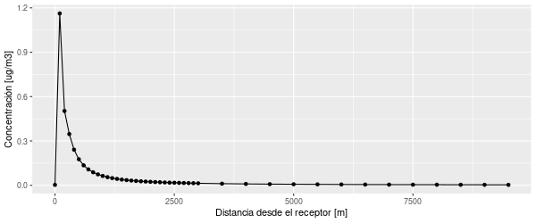

## Resumen
Se modela mediante el uso del SCREEN3 las oncentraciones de óxidos de nitrogeno [NOx] emitidas por la chimenea del emprendimiento XXXX.

Los resultados del modelo se comparan con los estándares de calidad de aire fijados por la norma XXX correspondiente a la autoridad de aplicación ambiental de la jurisdicción del establecimiento.

Se verifica que en ninguno de los receptores analizados, se superan las concentraciones límites reguladas.
(Se identifica que en X de los receptores analizados, se superan las concentraciones límites reguladas en un X% como máximo, detallando su ubicación en el punto de resultados.)


## 1. Introducción

### Objetivo
A efectos de controlar las emisiones gaseosas y su impacto asociado, se realiza mediante modelación matemática la simulación del comportamiento de los contaminantes en la atmósfera para los efluentes gaseosos del emprendimiento XXXX ubicado en XXXXXX, provincia de XXXXX.
 El presente estudio tiene como objeto relacionar la emisión de una fuente gaseosa y la calidad del aire ambiente resultante conforme a los métodos planteados en la norma XXXX del organismo regulador XXXXX.

### Descripción y justificación del modelo

Para el presente estudio se selecciona el modelo SCREEN3 de la Agencia de Protección Ambiental de los Estados Unidos (US-EPA). 

SCREEN3 es un modelo de pluma gaussiana para fuente simple, que estima la maxima concentración a nivel del suelo producida por fuentes puntuales, de area, antorhas, ó fuentes de volumen, asi como las concentración en cavidades producidas por  el flujo alrededor de edificios y en zonas de inversión por fumigación costera. 

El SCREEN3 es la versión de sondeo del modelo de detalle ISC3 y al momento de la realización de este estudio, la US-EPA lo tiene en su lista de modelos de sondeo recomendados. El programa así como el código fuente y casos de estudio están disponible para acceso público en el repositorio web de la [US-EPA 3](https://www.epa.gov/scram/air-quality-dispersion-modeling-screening-models).


### Sitio de estudio
La fuente de emisión corresponde al proceso de XXXXXX del predio ubicado en el partido de XXXXX, en las coordenadas latitud -XX.XX longitud -XX.XX .




**Mapa de ubicación**


### Características de fuentes emisoras
   A continuación se resumen las careacterísticas de las fuentes de emision consideradas en el modelo.

| id  |  X  [m utm 21] | Y [m utm 21] | Altutud [msnm] | Altura del conducto [m] | Diámetro del conducto [m] |
|----|----|----|----|----|----|
| C1 | XXXX.XX | XXXXX.XX | XX.X | 10.0 |  1.0|

**Tabla 1.** Caracteristicas de los conductos emisores.


A continuación se resumen los parámetros de emision.

| Analito | id | tipo  | Temperatura [ºC] | Velocidad [m/s] | Caudal másico [g/s] |
| ------- |----|---------|-------|------|---------|
|  NOx    | C1 | POINT   | 320.0 |  1.0 | 1.00e-3 |

**Tabla 2.** Parámetro de emision para cada conducto y analíto.

### Datos meteorológicos
La información meteorológica de superficie y sondeos verticales necesaria para la ejecución del modelo fue extraída de la base de datos de observaciones del Servicio Meteorológico Nacional (SMN), se representa su ubicación respecto a las fuentes en el [Anexo 7].

Se utilizó la siguiente estación de observación:


| Nombre  | Provincia  | Latitud | Longitud | Altitud | id (WMO) | id (ASCII) |
| ------- |------------|---------|----------|---------|----------|------------|
|  NOx    | XXXXX XXXX | XX.XX   | XX.XX    |  X.X    | XXXXXXX  | XXXXXXXXX  |

**Tabla 3.** Estación meteorológica utilizada.

## 2. Configuración del modelo

Explicitar las opciones (indicando palabras clave) utilizadas en cada modelado.


### Escenarios modelados
Con el fin de considerar el peor escenario, se realizo una serie de calculos considerando distintas velocidades de viento y disintas clases de establidad:

```
|     |       Velocidad del viento a 10m [m/s]            |
|Clase| 1 |1.5| 2 |2.5| 3 |3.5| 4 |4.5| 5 | 8 | 10| 15| 20|
|=====|===|===|===|===|===|===|===|===|===|===|===|===|===|
| A   | x | x | x | x | x |   |   |   |   |   |   |   |   |
| B   | x | x | x | x | x | x | x | x | x |   |   |   |   |
| C   | x | x | x | x | x | x | x | x | x | x | x |   |   |
| D   | x | x | x | x | x | x | x | x | x | x | x | x | x |
| E   | x | x | x | x | x | x | x | x | x |   |   |   |   |
| F   | x | x | x | x | x | x | x |   |   |   |   |   |   |

```

Ademas se considero un entorno URBANO, sin efecto de downwash ni de fumigación costera.

### Grilla de receptores

Se considero una grilla de N receptores equiespaciados cada 50 metros desde los 100 metros hasta los 10000 metros desde la fuente emisora considerada. 


### Datos meteorológicos

Para representar las variables meteorológicas se utilizaron valores representativos de las siguientes variables:

| Variable |  Valor representativo | Estadístico  | Periodo considerado |
|:---------|:---------------------:|:-------------|:-------------------:|
| Temperatura ambiente |  XX.XX  | Promedio de la serie temporal | 20XX-20XY |
| Dirección del viento |  XX.XX  | Moda de la serie temporal     | 20XX-20XY |

**Tabla 4.** Valores de variables meteorológicas utilizados especificando calculo usado, y periodo considerado.

## 3. Resultados


### Tabla de concentraciones máximas

Resumir en una tabla la concentración máxima calculada, explicitando distancia a la fuente, altura y condiciones meteorológicas.


### Gráfico de concentración calculada en función de la distancia
Representar en un gráfico la concentración calculada a nivel del receptor en función de la distancia a la fuente.
	


**Figura 1.** Gráfico concentración vs distancia.

### Receptor de máxima concentración

La máxima concentración encontrado fue a 100 metros de distancia del receptor, y el valor fue de 1.162. A continuación se muestra la salida del modelo:

```
MAXIMUM 1-HR CONCENTRATION AT OR BEYOND   100. M:
100.    1.162        4     1.0    1.0   320.0    9.25   15.76   13.88    NO
```


### Comparación con estándares reglamentarios
Se compararon los valores obtenidos del modelado con los estándares de calidad de aire para los compuestos considerados, los resultados se muestran a continuación:

| Analíto | Tiempo promedio | Concentración máxima [ug/m3] | Nivel regulatorio [ug/m3] | Observación |
|:-------:|:---------------:|:----------------------------:|:-------------------------:|:-----------:|
|  NOx    |   1 hora        |    1.162                     |  288                      |  -          |

**Tabla 5.** Comparación de resultados con normativa.


## 4. Conclusión

Los resultados cumplen con los estándares vigentes al momento de realización del estudio, correspondiendo a la tabla X de la norma X evaluando la concentración máxima respecto de la concentración límite. 


## Bibliografía

- “SCREEN3 Model User’s Guide”. U.S EPA. EPA-454/B-95-004. September 1995.
- “Guía metodológica para la evaluación del impacto ambiental atmosférico”. Laura Dawidowski, Darío Gómez y Silvia Reich. Honorable Cámara de Diputados de La Nación.
- “Calidad del aire - Monitoreo y modelado de contaminantes atmosféricos. Efectos en la salud pública” Porta, Andrés; Yanina Sanchez; Esteban Colman Lerner. UNLP, 2018.
Resolución 559-19 OPDS-Anexo III Instructivo para la aplicación de modelos de difusión atmosférica a efluentes gaseosos.

