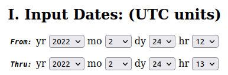
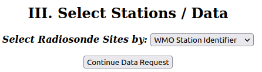
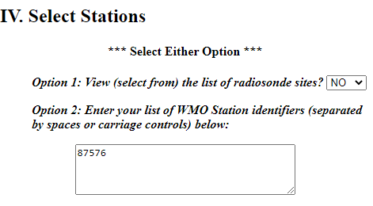
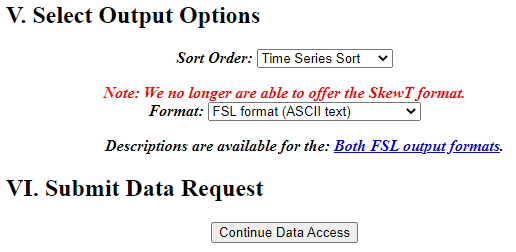

# AERMET

Tutorial para ejecución de preprocesador meteorológico del aermod (**AERMET**)
{: .fs-6 .fw-300 }

<!-- ## Resumen
Los pasos generales a seguir son:

0. Crear *directorio de trabajo*  :open_file_folder:``tutorial`` en donde colocaremos todos los archivos de corrida y ejecutables. 
1. Descargar [``aermet.zip``](https://gaftp.epa.gov/Air/aqmg/SCRAM/models/met/aermet/aermet_exe.zip) y descomprimirlo, colocar el ejecutable ``aermet.exe`` en el directorio de trabajo.
2. Descargar datos meteorológicos: de [superficie](https://www.ncei.noaa.gov/pub/data/noaa/) y [radiosondeos](https://ruc.noaa.gov/raobs). Colocarlos en el directorio de trabajo.
3. Construir *archivos de control* para cada etapa de ejecución:
	+ :page_facing_up: [``ETAPA1.INP``](./archivos/aermod/ETAPA1.INP), extracción y control de calidad de datos.
	+ :page_facing_up: [``ETAPA2.INP``](./archivos/aermod/ETAPA2.INP), fusión de datos de superficie y radiosondeos.
	+ :page_facing_up: [``ETAPA3.INP``](./archivos/aermod/ETAPA3.INP), cálculo de parámetros de capa límite.
4. Verificar que estén todos los archivos mencionados en los puntos anteriores y el ejecutable en el directorio de trabajo.
5. Ejecutar cada etapa en el siguiente orden: 
	1. Copiar ``ETAPA1.INP`` como ``aermet.inp`` y hacer doble click en ``aermet.exe``
	2. Copiar ``ETAPA2.INP`` como ``aermet.inp`` y hacer doble click en ``aermet.exe``
	3. Copiar ``ETAPA3.INP`` como ``aermet.inp`` y hacer doble click en ``aermet.exe``

en las siguientes secciones se presenta cada pasos detallado.
-->
---

## Directorio de trabajo

Durante la ejecución del **AERMOD** y todos sus programas asociados vamos a trabajar con muchos archivos. Para mantener el orden y evitar errores, sugerimos generar una carpeta ó *directorio de trabajo* donde vamos a colocar todos los archivos y ejecutables, sin importar que nombre y ubicación le asignamos.
Como vamos a estar modificando las extensiones de varios archivos, debemos asegurar que estas están visibles.
En Windows 10, en el directorio de trabajo activamos esa opción desde la pestaña "Vista", tildando el casillero:"Extensiones de nombre de archivo".


## Descarga de ejecutable

Descargamos el programa de la página de la EPA: [``aermet_exe.zip``](https://gaftp.epa.gov/Air/aqmg/SCRAM/models/met/aermet/aermet_exe.zip), lo descomprimimos y colocamos el ejecutable ``aermet.exe`` en la carpeta de trabajo.

## Descarga de datos meteorológicos:

Para poder ejecutar el **AERMET** vamos a necesitar disponer de datos meteorológicos de superficie y radiosondeos. 

Para descargar datos meteorológicos tienen que buscar la estación más cercana al proyecto a modelar que cuente con buena disponibilidad de datos. Del listado de [estaciones disponibles](refs/estaciones_smn.csv), se debe elegir la mas cercana y obtener su *id* definido globalmente por la Organización Mundial de Meteorología (WMO), que se encuentra en la columna ``NRO``.

**En este tutorial vamos a seleccionar para el año *2021*, la siguiente estación:

| Nombre	|Provincia	|Latitud	|Longitud	|Altura [m]	|NRO	   |NACI |
|EZEIZA AERO	|BUENOS AIRES	|-58.53333	|-34.81667	|20.0	        |**87576** |SAEZ |


### Meteorología de superficie: 

Los datos de meteorología de superficie se pueden descargar del [Integrated Surface Database (ISD)](https://www.ncei.noaa.gov/pub/data/noaa/) y buscando por año (2021) y luego por id (87576) van a encontrar el archivo.

Vamos a buscar nuestro archivo usando el año de interés y el *id* de la estación. Para nuestro caso tendríamos que descargar el archivo: [``https://www.ncei.noaa.gov/pub/data/noaa/2021/875760-99999-2021.gz``](https://www.ncei.noaa.gov/pub/data/noaa/2021/875760-99999-2021.gz)

Se va a descargar un archivo comprimido con extensión ``.gz`` (gzip), al descomprimirlo encontraremos un archivo de texto de nombre [875760-99999-2021](archivos/aermod/875760-99999-2021), lo vamos a renombrar ``PRUEBA.ISH``. Si lo abren verán el siguiente contenido:

```Text
0124875760999992021010100004-34467-058517FM-12+002099999V0203401N0015122000199010000199+02601+00621101151ADDAA101999999AZ101061AZ201061GF100991999999999999999999KA1120M+03031KA2120N+01751MA1999999100921MD1210051+9999REMSYN004BUFR
0078875760999992021010100004-34822-058536FM-15+002099999V0203201N001519999999Y009900599+02601+00601999999ADDMA1101101999999REMMET051METAR SAEZ 010000Z 32003KT CAVOK 26/06 Q1011 NOSIG=
0089875760999992021010101004-34817-058533FM-12+002099999V0203401N001519999999N010000199+02501+00741101201ADDMA1999999100971MD1210081+9999REMSYN04887576 42960 03403 10250 20074 30097 40120 52008=
... (continúa)
```

### Radiosondeos:

Para el caso de la información del perfil de la atmósfera por radiosondeos, en Argentina solamente contamos con 6 estaciones que hacen esta medición:


|Nombre				|Provincia	|Latitud	|Longitud	|Altura [m]	|NRO	|NACI|
|---|---|---|---|---|---|---|
|EZEIZA AERO			|BUENOS AIRES	|-58.53333	|-34.81667	|20.0		|87576	|SAEZ|
|SANTA ROSA AERO		|LA PAMPA	|-64.26667	|-36.56667	|191.0		|87623	|SAZR|
|MENDOZA AERO			|MENDOZA	|-68.78333	|-32.83333	|704.0		|87418	|SAME|
|RESISTENCIA AERO		|CHACO		|-59.05000	|-27.45000	|52.0		|87155	|SARE|
|COMODORO RIVADAVIA AERO	|CHUBUT		|-67.50000	|-45.78333	|46.0		|87860	|SAVC|
|CORDOBA AERO			|CORDOBA	|-64.20000	|-31.30000	|495.0		|87344	|SACO|


Los radiosondeos se descargan de [NOAA/ESRL Radiosonde Database](https://ruc.noaa.gov/raobs), donde al completar un formulario se va a generar un archivo con la información requerida.

Primero nos va a pedir la fecha de inicio y fin de la serie de datos que queremos descargar.

 

Luego vamos a tener que especificar horas de acceso (seleccionar ``0z, 12z ONLY``), los niveles verticales (seleccionar ``All levels``), y las unidades para la velocidad de viento (seleccionar ``Tenths of Meters/Second``) en decenas de metros por segundo.

 

Por ultimo en para la selección de sitios poner ``WMO Station Identifier``.

 

Hacemos click en ``Continue Data Request`` y nos lleva a la siguiente pantalla donde hay un cuadro para completar con el id de nuestra estación (87576, correspondiente a EZEIZA AERO).



Dejamos los valores de orden como ``Time Series Sort`` y formato ``FSL`` por defecto. Finalizamos tocando ``Continue Data Access``


Vamos a obtener como texto la infomación solicitada. Para guardarla, seleccionamos toda la información <kbd>Ctrl</kbd> + <kbd>A</kbd> y la copiamos <kbd>Ctrl</kbd> + <kbd>C</kbd>. Abrimos el block de notas, pegamos esta información y guardamos el archivo como [PRUEBA.FSL](./archivos/aermod/PRUEBA.FSL) en el directorio de trabajo.

El inicio del archivo debiera tener este contenido:

```Text
254     12      1      JAN    2021
      1  99999  87576  34.82S 58.53W    20   1134
      2    200   1820    933    112  99999      3
      3          SAEZ                99999     ms
      9  10130     20    208     98    290     41
      4  10000    130    214     64    285     46
      5   9880    234    204     64  99999  99999
      6   9800    304  99999  99999    250     82
      5   9690    401    218     38  99999  99999
      6   9460    609  99999  99999    245    113
      4   9250    804    200     30    250    113
      5   9170    878    196     26  99999  99999
      6   9131    914  99999  99999    245    103
      6   8811   1219  99999  99999    235     93
      6   8502   1524  99999  99999    255     72
      4   8500   1526    146     26    245     67
      6   8196   1828  99999  99999    230     62
      6   7900   2133  99999  99999    205     72
      5   7630   2421     68     -2  99999  99999
      6   7614   2438  99999  99999    190     98
      6   7334   2743  99999  99999    195     87
      5   7270   2815     50    -80  99999  99999
      5   7090   3019     52   -158  99999  99999
      6   7066   3048  99999  99999    235    103
      4   7000   3130     44    -76    230    103
      5   6990   3142     44    -66  99999  99999
      5   6570   3643     26   -174  99999  99999
      6   6559   3657  99999  99999    210    118
... (continúa)
```

<!-- ### Datos sitio-especificas 
En caso de disponer datos de una estación meteorológica privada también es posible incorporar los datos al modelo, solo es necesario que estén en algún formato tipo tabla donde cada fila sea una observación y cada columna sea una variable distinta, como puede ser una planilla de excel.  
-->

## Ejecución

Para ejecutar el **AERMET** primero verificamos que estén todos los archivos necesarios en el directorio de trabajo:
+ ``PRUEBA.ISH``
+ ``PRUEBA.FSL``
+ ``aermet.exe``

El **AERMET** se ejecuta en 3 etapas a las que llamaremos: **ETAPA1**, **ETAPA2** y **ETAPA3**. Cada una de estas necesita un *archivo de control*, que es un archivo de texto con definición de parámetros para configurar la corrida y permitirle a AERMET realizar cada etapa con los datos que disponemos.

A los archivos de control los llamaremos ``ETAPA1.INP``, ``ETAPA2.INP`` y ``ETAPA3.INP``.


### Etapa 1:  Lectura y procesamiento de datos de entrada.

En esta etapa tenemos que proveer al **AERMET** con los archivos de entrada y parámetros para extraerlos.

Vamos a tener que construir un archivo de control donde vamos a especificar las rutas a los archivos de entrada, las fechas de extracción, ubicación y parámetros de las estaciones meteorológicas, entre otros.

Creamos un archivo de texto y lo nombramos: [ETAPA1.INP](./archivos/aermet/ETAPA1.INP). Copiamos en él el siguiente contenido: 

```Text
** ETAPA 1: Lectura y procesamiento de datos de entrada.
JOB
MESSAGES ETAPA1.MSG
REPORT   ETAPA1.RPT
**    Datos horarios de superficie:
SURFACE
DATA       PRUEBA.ISH ISHD
EXTRACT    EXTRACT_SFC.DSK
XDATES     2021/12/01 TO 21/12/31
LOCATION   87576  34.820S  058.583W  3  +0003
AUDIT      WDIR WSPD CLHT TSKC RHUM
QAOUT      QA_SFC.OUT
**    Datos de sondeos verticales:
UPPERAIR
DATA       PRUEBA.FSL FSL
EXTRACT    EXTRACT_UA.DSK
XDATES     2021/12/01 TO 21/12/31
LOCATION   87576  34.82S  58.53W  3
AUDIT      UAPR  UAHT  UATT  UATD  UAWD  UAWS
QAOUT      QA_UA.OUT
```

Todas las lineas que comienzan con ``**`` son interpretadas como *comentarios* y por lo tanto, el programa las ignora.

El archivo ``ETAPA1.INP`` se divide en las siguientes secciones:
+ ``JOB ``: Se especifican los nombres de los archivos donde el programa guardará los registros de la ejecución (mensajes de alerta y errores).
+ ``SURFACE ``: Se brinda la ruta al archivo de superficie, el formato, y las fechas de inicio y fin de la corrida, y ubicación de la estación.
+ ``UPPER ``: se brinda la ruta al archivo de radiosondeo, el formato, y las fechas de inicio y fin de la corrida, y ubicación de la estación.


En la carpeta de trabajo (donde debe estar el ejecutable), guardamos este archivo con el nombre ``ETAPA1.INP``, luego lo copiamos nombrando la copia ``aermet.inp`` y ejecutamos el ``aermet.exe``.

Si todo sale bien se van a crear los siguientes archivos:
+ ``ETAPA1.MSG`` y ``ETAPA1.RPT`` nos brindan información de como fue la ejecución, y en caso de haber un error ahi habrán mensajes de alerta ó error.
+ ``EXTRACT_SFC.DSK`` y ``EXTRACT_UA.DSK`` contienen los datos extraidos de los archivos meteorológicos de superficie y radiosondeos respectivamente.
+ ``QA_SFC.OUT`` y ``QA_UA.OUT`` archivos con información de variables auditadas que serviran par el siguiente paso.
+ ``Discarded_ISHD_Records.dat`` si algun registro no cumple los parametros de calidad entonces se descartan y se guardan en este archivo para su revisión.

### Etapa 2: Fusión (merge) de archivos

En esta etapa se fusionan los datos de superficie con los meteorológicos.
También necesitamos crear un archivo de control: [ETAPA2.INP](./archivos/aermet/ETAPA2.INP) con el siguiente contenido:

```Text
** Stage 2: Merge de datos.
JOB
MESSAGES ETAPA2.MSG
REPORT   ETAPA2.RPT
SURFACE
QAOUT  QA_SFC.OUT
UPPERAIR
QAOUT  QA_UA.OUT
MERGE
OUTPUT PRUEBA.MRG
XDATES 2021/12/01 TO 21/12/31
```

Este archivo contiene las siguientes secciones:
+ ``JOB ``: Cumple el mismo rol que en etapa 1.
+ ``SURFACE ``: Se especifica el archivo con los datos de superficie extraidos en la etapa 1.
+ ``UPPER ``: Se especifica el archivo con los datos de radiosondeo extraidos en la etapa 1.
+ ``MERGE``: en esta sección se especifica el archivo de salida con los datos de superficie y radiosondeo fusionados que será la entrada en la etapa 3.

Guardamos este archivo con el nombre ``ETAPA2.INP``, y luego lo copiamos como ``aermet.inp`` (reemplazando el preexistente) y ejecutamos el ``aermet.exe``.

Se van a crear los siguientes archivos:
+ ``ETAPA2.MSG`` y ``ETAPA2.RPT`` nos brindan información de warnings y errores.
+ ``PRUEBA.MRG`` contienen los datos fusionados que serán utilizados en el siguiente paso.

### Etapa 3: Cálculo de parametros de capa límite

Este es el úlitmo paso, y es donde se relizan los cálculos que serviran como información de entrada al **AERMOD**.

Vamos a crear nuestro archivo de control: [ETAPA3.INP](./archivos/aermet/ETAPA3.INP) con el siguiente contenido:

```Text
** Stage 3 - Estimación de parametros de la capa límite y creación de .SFC y .PFL
JOB
MESSAGES ETAPA3.MSG
REPORT   ETAPA3.RPT
METPREP
DATA        PRUEBA.MRG
LOCATION    A212 34.450S 058.583W  3
XDATES      2021/01/01 TO 21/12/31
OUTPUT      PRUEBA.SFC
PROFILE     PRUEBA.PFL
** Métodos para precesamiento de datos:
METHOD   WIND_DIR  RANDOM
METHOD   REFLEVEL  SUBNWS
NWS_HGT  WIND      10.0
METHOD   UASELECT SUNRISE
UAWINDOW -12 12
AERSURF AERSURFACE.OUT
```

Este archivo sólo dos secciones:
+ ``JOB``: lo mismo que en los pasos anteriores.
+ ``METPREP``: en esta secciones especificamos el archivo de salida del ETAPA2, y luego una serie de **keywords** y parámetros que hacen referencia a métodos a emplear para el cálculo y como utilizar la información. Finalmente se especifica el nombre de el archivo con información de parámetros de superficie del suelo cerca a las estaciones ``AERSURFACE.OUT``.

Vamos a necesitar un archivo llamado [``AERSURFACE.OUT``](./archivos/aermod/AERSURFACE.OUT) con propiedades de la superficie, que se puede generar manualmente ó utilizando la herramienta **AERSURFACE**. En el apartado [AERSURFACE](/mca-fauba/tut/aersurface.html) se explican los pasos y criterios para completar el archivo ``AERSURFACE.OUT``. En este caso vamos a crear un nuevo archivo de texto, lo guardamos con el nombre de ``AERSURFACE.OUT`` con el siguiente contenido:

```Text
 FREQ_SECT  SEASONAL  1
   SECTOR   1  0   360
**------------------------------------------------|
**          | season | section | a0  | b0  | z0   |
**----------|--------|---------|-----|-----|------|
   SITE_CHAR    1        1      0.16  0.80  0.54
   SITE_CHAR    2        1      0.16  1.00  0.54
   SITE_CHAR    3        1      0.18  1.00  0.50
   SITE_CHAR    4        1      0.16  0.80  0.52
**----------|--------|---------|-----|-----|------|

```

Para ejecutar la ultima etapa, verificamos que estén presente los archivos:
- ``PRUEBA.MRG`` generado al correr la ETAPA 2.
- ``AERSURFACE.OUT`` generado en el paso anterior.

Guardamos este archivo con el nombre ``ETAPA3.INP``, y luego lo copiamos y renombramos la copia como ``aermet.inp`` y ejecutamos el ``aermet.exe``.

Se van a crear dos archivos necesarios para la ejecución del **AERMOD**:

- ``PRUEBA.SFC``: contiene los datos de superficie procesados.
- ``PRUEBA.PFL``: contiene los datos de perfiles vericales procesados.

Verificamos que la corrida fue exitosa si en los archivos PRUEBA3.RPT no aparecen mensajes de ERROR.

```Text
        ****    ERROR MESSAGES    ****

               ---  NONE  ---
```


