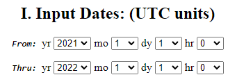
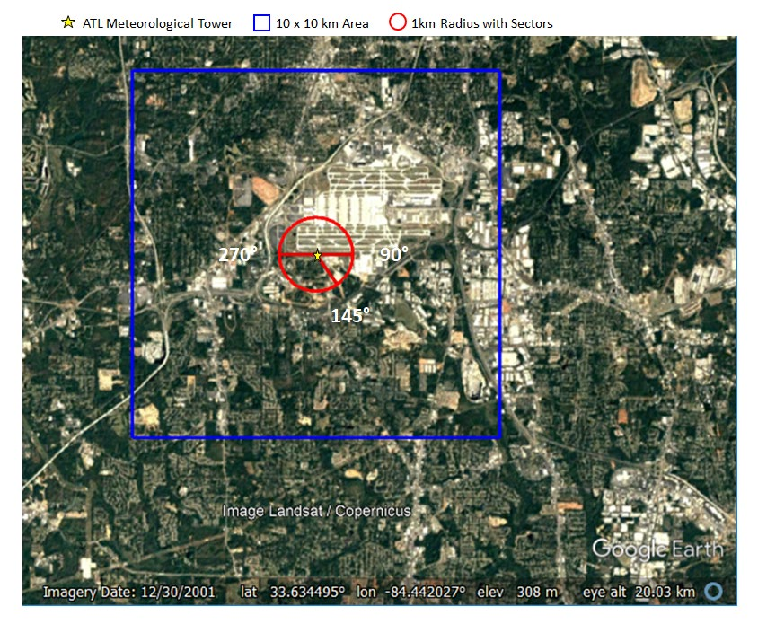

# Aermod: AERMET

> Tutorial para ejecución de preprocesador meteorológico del aermod (**AERMET**)

## Resumen
Los pasos generales a seguir son:

0. Crear *directorio de trabajo*  :open_file_folder:``tutorial`` en donde colocaremos todos los archivos de corrida y ejecutables. 
1. Descargar [``aermet.zip``](https://gaftp.epa.gov/Air/aqmg/SCRAM/models/met/aermet/aermet_exe.zip) y descomprimirlo, colocar el ejecutable ``aermet.exe`` en el directorio de trabajo.
2. Descargar datos meteorológicos: de [superficie](https://www.ncei.noaa.gov/pub/data/noaa/) y [radiosondeos](https://ruc.noaa.gov/raobs). Colocarlos en el directorio de trabajo.
3. Construir *archivos de control* para cada etapa de ejecución:
	+ :page_facing_up: [``ETAPA1.INP``](./archivos/aermod/ETAPA1.INP), extracción y control de calidad de datos.
	+ :page_facing_up: [``ETAPA2.INP``](./archivos/aermod/ETAPA2.INP), fusión de datos de superficie y radiosondeos.
	+ :page_facing_up: [``ETAPA3.INP``](./archivos/aermod/ETAPA3.INP), cálculo de parámetros de capa límite.
4. Verificar que estén todos los archivos mencionados en los puntos anteriores y el ejecutable en el directorio de trabajo.
5. Ejecutar cada etapa en el siguiente orden: 
	1. Copiar ``ETAPA1.INP`` como ``aermet.inp`` y hacer doble click en ``aermet.exe``
	2. Copiar ``ETAPA2.INP`` como ``aermet.inp`` y hacer doble click en ``aermet.exe``
	3. Copiar ``ETAPA3.INP`` como ``aermet.inp`` y hacer doble click en ``aermet.exe``

en las siguientes secciones se presenta cada pasos detallado.


---

## Directorio de trabajo

Durante la ejecución del **AERMOD** y todos sus programas asociados vamos a trabajar con muchos archivos. Para mantener el orden y evitar errores, sugerimos generar una carpeta ó *directorio de trabajo* donde vamos a colocar todos los archivos y ejecutables. Es irrelevante el nombre del directorio y ubicación de esta.


## Descarga de ejecutable

Descargamos el ejecutable de la página de la EPA: [``aermet.exe``](https://gaftp.epa.gov/Air/aqmg/SCRAM/models/met/aermet/aermet_exe.zip), lo descomprimimos y colocamos el ejecutable ``aermet.exe`` en la carpeta de trabajo.

Descomprimimos el ``aermet_exe.zip`` y colocamos el ejecutable ``aermet.exe`` en el directorio de trabajo.

> :information_source: También es posible descargarse el código fuente: [aermet_soruce.zip](https://gaftp.epa.gov/Air/aqmg/SCRAM/models/met/aermet/aermet_source.zip)


## Descarga de datos meteorológicos:

Para poder ejecutar el **AERMET** vamos a necesitar disponer de datos meteorológicos de superficie y radiosondeos. 

Para descargar datos meteorológicos tienen que buscar la estación más cercana al proyecto a modelar que cuente con buena disponibilidad de datos. Cada estación meteorológica tiene un *id* definido globalmente por la Organización Mundial de Meteorología (WMO), en este documento pueden ver los datos generales con id de las estaciones meteorológicas de la red Argentina: [estaciones_smn.csv](refs/estaciones_smn.csv).

**En este tutorial vamos a seleccionar el año *2021*, y la estación *EZEIZA AERO* cuyo id es 87576.**

### Meteorología de superficie: 

Los datos de meteorología de superficie se pueden descargar del [Integrated Surface Database (ISD)](https://www.ncei.noaa.gov/pub/data/noaa/) y buscando por año y luego por id van a encontrar el archivo.

Vamos a buscar nuestro archivo usando el año de interés y el *id* de la estación. Para nuestro caso tendríamos que descargar el archivo: ``https://www.ncei.noaa.gov/pub/data/noaa/2021/875760-99999-2021.gz``

Se va a descargar un archivo con extensión ``.gz`` (gzip), es un archivo comprimido, hay que descomprimirlo, y dentro habrá un archivo de texto de nombre [875760-99999-2021](archivos/aermod/875760-99999-2021), se lo vamos a cambiar a ``PRUEBA.ISH``. Si lo abren veran del siguiente contenido:

```Text
0159875530999992021010100004-34450-058583FM-12+000399999V0203401N003119999999N007000199+02431+00891101231ADDAY101021AY201021KA1120M+02901KA2120N+02001MA1999999101201MD1310071+9999MW1041REMSYN07087553 31957 03406 10243 20089 30120 40123 53007 70400 333 10290 20200=
0101875530999992021010100004-34453-058590FM-15+000399999V0203401N003612200019N007000199+02401+00901999999ADDGF100991999999999999999999MA1101201999999REMMET048METAR SADF 010000Z 34007KT 7000 NSC 24/09 Q1012=
0117875530999992021010101004-34450-058583FM-12+000399999V0203401N003619999999N009000199+02291+01141101281ADDAY101021AY201021MA1999999101241MD1210111+9999MW1041REMSYN05487553 41959 03407 10229 20114 30124 40128 52011 70400=
... (continúa)
```

### Radiosondeos:

Los radiosondeos se descargan de [NOAA/ESRL Radiosonde Database](https://ruc.noaa.gov/raobs), hay que completar una serie de datos, elegir la fecha y estación, y se va a generar un archivo que puede descargarse.


Nos va a pedir en una primer etapa la fecha de inicio y fin de datos que queremos descargar.

 

Luego vamos a tener que especificar horas de acceso (seleccionar ``0z, 12z ONLY``), los niveles (seleccionar ``Mandatory``), y las unidades para la velocidad de viento (seleccionar ``Tenths of Meters/Second``).

 

Por ultimo en para la seleccion de sitios poner ``WMO Station Identifier``.

 

Luego hacemos click en ``Continue Data Request`` y nos lleva a la siguiente pantalla donde hay un espacio para completar con el id de nuestra estación (87576, correspondiente a EZEIZA AERO).


Dejamos los valores de orden como ``Time Series Sort`` y formato ``FSL`` por defecto. Finalizamos tocando ``Continue Data Access``


Se va a descargar un archivo de texto, le vamos a colocar el nombre [PRUEBA.FSL](./archivos/aermod/PRUEBA.FSL) cuyo contenido es:

```Text
   254     12      5      JAN    2021
      1  99999  87576  34.82S 58.53W    20   1127
      2    200   1230    741     20  99999      3
      3          SAEZ                99999     ms
      9  10120     20    244    154      5     36
      4  10000    124    232    132    360     82
      4   9250    797    182    102    360    108
      4   8500   1515    150    -50     20     62
      4   7000   3136     78    -82    245    108
      4   5000   5820    -91   -311    255    118
      4   4000   7500   -221   -431    265    185
      4   3000   9550   -363   -573    255    345
      4   2500  10800   -445   -615    270    427
      4   2000  12260   -517   -697    280    468
      4   1500  14080   -625   -785    285    422
      4   1000  16550   -671   -861    275    185
      4    700  18680   -709   -939    230    103
      4    500  20680   -631   -911    170     46
      4    300  23870   -543   -853     90     72
      4    200  26490   -481   -811     90    123
    254     12      6      JAN    2021
      1  99999  87576  34.82S 58.53W    20   1132
... (continúa)
```

### Datos sitio-especificas
En caso de disponer datos de una estación meteorológica privada también es posible incorporar los datos al modelo, solo es necesario que estén en algun formato tipo tabla donde cada fila sea una observación y cada columna sea una variable distinta, como puede ser una planilla de excell. 


## Ejecución

Para ejectuar el **AERMET** primero verificamos que estén todos los archivos necesarios en el directorio de trabajo:
+ ``PRUEBA.ISH``
+ ``PRUEBA.FSL``
+ ``aermet.exe``

El **AERMET** se ejecuta en 3 etapas a las que llamaremos: **ETAPA1**, **ETAPA2** y **ETAPA3**. Cada una de estas necesita un *archivo de control*, que básicamente es un archivo de texto con definición de parámetros para configurar la corrida y permitirle al AERMET realizar cada etapa con los datos que disponemos.

A los archivos de control los llamaremos ``ETAPA1.INP``, ``ETAPA2.INP`` y ``ETAPA3.INP``.


### Etapa 1:  Lectura y procesamiento de datos de entrada.

En esta etapa tenemos que proveer al **AERMET** con los archivos de entrada y parámetros para extraerlos.

Vamos a tener que construir un archivo de control donde vamos a especificar las rutas a los archivos de entrada, las fechas de extracción, ubicación y parámetros de las estaciones meteorológicas entre otros.

Este archivo de control lo nombraremos: [ETAPA1.INP](./archivos/aermet/ETAPA1.INP) y se divide en las siguientes secciones:

+ ``JOB ``: en esta sección se especifican los nombres de archivos con información de la ejecución.
+ ``SURFACE ``: se brinda la ruta al archivo de superficie, el formato, y las fechas de incio y fin de la corrida.
+ ``UPPER ``: se brinda la ruta al archivo de radiosondeo, el formato, y las fechas de incio y fin de la corrida.
+ ``ONSITE `` (opcional): se brinda la ruta al archivo de observaciones in-situ y formato.

Para nuestro ejemplo:

```Text
** ETAPA 1: Lectura y procesamiento de datos de entrada.
JOB
MESSAGES ETAPA1.MSG
REPORT   ETAPA1.RPT
**    Datos horarios de superficie:
SURFACE
DATA       PRUEBA.ISH ISHD
EXTRACT    EXTRACT_SFC.DSK
XDATES     2021/12/01 TO 21/12/31
LOCATION   87576  34.820S  058.583W  3  +0003
AUDIT      WDIR WSPD CLHT RHUM
QAOUT      QA_SFC.OUT
**    Datos de sondeos verticales:
UPPERAIR
DATA       PRUEBA.FSL FSL
EXTRACT    EXTRACT_UA.DSK
XDATES     2021/12/01 TO 21/12/31
LOCATION   87576  34.82S  58.53W  3
AUDIT      UAPR  UAHT  UATT  UATD  UAWD  UAWS
QAOUT      QA_UA.OUT
```

Notar que todas las lineas que comienzan con ``**`` son interpretadas como *comentarios* (el programa las ignora).

En la carpeta de trabajo (donde debe estar el ejecutable), guardamos este archivo con el nombre ``ETAPA1.INP``, y luego lo copiamos como ``aermet.inp`` y ejecutamos el AERMET.EXE haciendo doble click.

Si todo sale bien se van a crear los siguientes archivos:
+ ``ETAPA1.MSG`` y ``ETAPA1.RPT`` nos brindan información de como fue la ejecución, y en caso de haber un error ahi habrán mensajes de alerta ó error.
+ ``EXTRACT_SFC.OUT`` y ``EXTRACT_UA.OUT`` contienen los datos extraidos de los archivos meteorológicos de superficie y radiosondeos respectivamente.
+ ``QA_SFC.OUT`` y ``QA_UA.OUT`` archivos con información de variables auditadas que serviran par el siguiente paso.
+ ``Discarded_ISHD_Records.dat`` si algun registro no cumple los parametros de calidad entonces se descartan y se guardan en este archivo para su revisión.

### Etapa 2: Fusión (merge) de archivos

En esta etapa se fusionan los datos de superficie con los meteorológicos.
También necesitamos crear un archivo de control: [ETAPA2.INP](./archivos/aermet/ETAPA2.INP) que tiene las siguientes secciones:
+ ``JOB ``
+ ``SURFACE ``
+ ``UPPER ``
+ ``ONSITE `` (opcional)
+ ``MERGE`` 

Para nuestro ejemplo:

```Text
** Stage 2: Merge de datos.
JOB
MESSAGES ETAPA2.MSG
REPORT   ETAPA2.RPT
SURFACE
QAOUT  QA_SFC.OUT
UPPERAIR
QAOUT  QA_UA.OUT
MERGE
OUTPUT PRUEBA.MRG
XDATES 2021/12/01 TO 21/12/31
```

Guardamos este archivo con el nombre ``ETAPA2.INP``, y luego lo copiamos como ``aermet.inp`` y ejecutamos el ``aermet.exe`` haciendo doble click.

Se van a crear los siguientes archivos:
+ ``ETAPA2.MSG`` y ``ETAPA2.RPT`` nos brindan información de warnings y errores.
+ ``PRUEBA.MRG`` contienen los datos fusionados que serán utilizados en el siguiente paso.

### Etapa 3: Cálculo de parametros de capa límite

Este es el úlitmo paso, y es donde se relizan los cálculos que serviran como información de entrada al **AERMOD**.

Vamos a crear nuestro archivo de control: [ETAPA3.INP](./archivos/aermet/ETAPA3.INP) que tiene sólo dos secciones:
+ ``JOB``: lo mismo que en los pasos anteriores.
+ ``METPREP``: en esta secciones especificamos el archivo de salida del ETAPA2, y luego una serie de flags que hacen referencia a métodos a emplear para el cálculo de los parámetros y como utilizar la información. También se brindan archivos con información de parámetros de superficie del suelo cerca a las estaciones.

Por ejemplo:
```Text
** Stage 3 - Estimación de parametros de la capa límite y creación de .SFC y .PFL
JOB
MESSAGES ETAPA3.MSG
REPORT   ETAPA3.RPT
METPREP
DATA        PRUEBA.MRG
LOCATION    A212 34.450S 058.583W  3
XDATES      2021/01/01 TO 21/12/31
OUTPUT      PRUEBA.SFC
PROFILE     PRUEBA.PFL
** Métodos para precesamiento de datos:
METHOD   WIND_DIR  RANDOM
METHOD   REFLEVEL  SUBNWS
NWS_HGT  WIND      10.0
METHOD   UASELECT SUNRISE
UAWINDOW -12 12
AERSURF AERSURFACE.OUT
```


Vamos a necesitar el archivo [AERSURFACE.OUT](./archivos/aermod/AERSURFACE.OUT) con propiedades de la superficie, que se puede generar manualmente ó utilizando la herramienta **AERSURFACE**:

---

#### AERSURFACE:

El **AERSURFACE** es un preprocesador que nos permite estimar parámetros de superficie representativos para las cercanias de la estación meteorológica, usando datos de usos de suelo, canopeo e impermeabilidad del suelo.

Este programa necesita datos que lamentablemente no tenemos con cobertura en todo el país. Y por lo tanto estamos imposibilitados a usarlo. 

Sin embargo se puede generar el archivo ``AERSURFACE.OUT`` de forma manual, ya que este es simplemente un archivo de texto con algunas especificaciones, por ejemplo:

```Text
 FREQ_SECT  SEASONAL  3
   SECTOR   1  0   30
   SECTOR   2  30  360
**------------------------------------------------|
**          | season | section | a0  | b0  | z0   |
**----------|--------|---------|-----|-----|------|
   SITE_CHAR    1        1      0.18  0.70  0.01
   SITE_CHAR    2        1      0.15  0.30  0.015
   SITE_CHAR    3        1      0.15  0.50  0.02
   SITE_CHAR    4        1      0.15  0.70  0.015
   SITE_CHAR    1        2      0.18  1.00  0.30
   SITE_CHAR    2        2      0.16  0.80  0.40
   SITE_CHAR    3        2      0.16  0.80  0.40
   SITE_CHAR    4        2      0.16  0.80  0.40
**----------|--------|---------|-----|-----|------|
```
Recordar que ``**`` convierte la linea en un comentario, y por lo tanto no tiene ningun efecto.

Antes de explicar que define cada *keyword* tenemos que saber que vamos a considerar un area circular de 1km de radio alrededor del la estación meteorológica y vamos a definir radialmente secciones con distintas propiedades de la superficie:



Cada seccion va a representar una cobertura distinta, con parámetros de albedo, bowen y rugosidad distintas. 

A su vez estas propiedades pueden cambiar en el tiempo: mensual, estacional ó anualmente.

La palabra clave ``FREQ_SECT`` permite definir como queremos que cambien los parámetros de superficie en el tiempo: (``ANNUAL``, ``SEASONAL`` ó ``MONTHLY``)  y el numero de sectores con superficies distintas alrededor de la estación meteorológica.

Con la keyword ``SECTOR`` se define para cada sector cual es el angulo de inicio y fin que lo define. Siempre considerando que el 0 se encuentra en el norte, y que avanza de forma antioraria.

Por último para cada sector y cada season hay que definir los valores de albedo, bowen y rugosidad usando la keyword: ``SITE_CHAR``.

Este archivo lo guardamos con el nombre de ``AERSURFACE.OUT`` (el nombre es solo una convención), e incorporamos al final del archivo ``ETAPA3.INP`` la linea:

```Text
AERSURF AERSURFACE.OUT
```

---


Para ejecutar la ultima etapa, verificamos que estén presente los archivos:
- ``PRUEBA.MRG`` generado al correr la ETAPA 2.
- ``AERSURFACE.OUT`` generado al correr el aersurface ó creado manualmente.

Guardamos este archivo con el archivo de control de la tercer etapa con el nombre ``ETAPA3.INP``, y luego lo copiamos como ``aermet.inp`` y ejecutamos el ``aermet.exe`` haciendo doble click.

Si todo sale bien se van a crear dos archivos necesarios para la ejecución del **AERMOD**:

- ``PRUEBA.SFC``: contiene los datos de superficie procesados.
- ``PRUEBA.PFL``: contiene los datos de perfiles vericales procesados.


