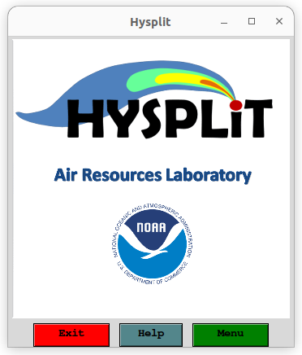
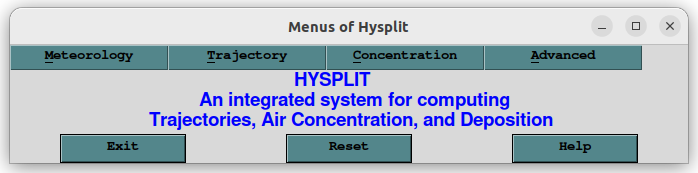
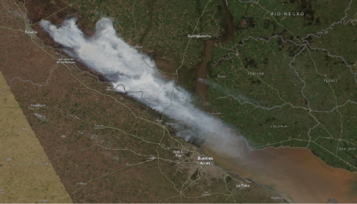
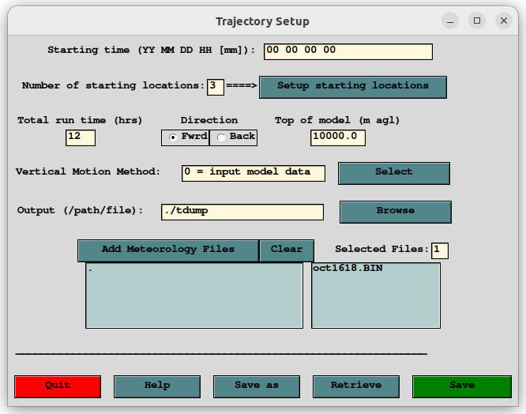
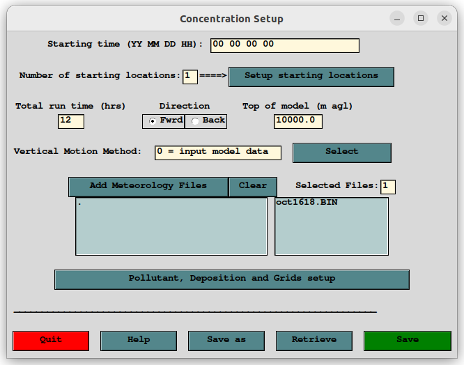

# Hysplit

Tutorial para uso de **Hysplit**
{: .fs-6 .fw-300 }

<!-- ## Resumen
En esta sección estan los pasos rápidos para la ejecución del **SCREEN3**:

1. Descargar ejecutable ``SCREEN3.exe`` y código fuente: [``screen3.zip``](https://gaftp.epa.gov/Air/aqmg/SCRAM/models/screening/screen3/screen3.zip).
2. Ejecutar ``SCREEN3.exe`` haciendo doble click sobre este.
3. Ingresar los datos que pide el programa. Los resultados se guardarán en el archivo ``SCREEN.OUT``.

En la siguientes secciones, se encuentran todos los pasos en detalle.
-->
---

## Descarga

El **HYSPLIT** está disponible en el web del [ARL]() (Air Resources Laboratory). Se puede descargar del siguiente link: .

Debería descargarse un archivo comprimido ``hysplit.v5.2.3_UbuntuOS20.04.4LTS.tar.gz``, al descomprimirlo habrá una carpeta con varios archivos. 

## Ejecución

Ir a la carpeta ``/working``, y ejecutar el archivo ``hysplit.tcl``. Se puede ver que se abre una ventana con una interfaz gráfica:

Al clickiar en el botón **Menu** se va a abrir una nueva ventana:

En esta se puden ver las siguientes solapas:
+ *Meteorology:* Opciones para descargar datos meteorológicos ó transformar a formatos que Hysplit pueda leer.
+ *Trajectory:* Opciones para configurar, ejecutar y graficar simulaciones de trayectorias (directas e inversas).
+ *Concentration:* Opciones para configurar, ejecutar y graficar simulaciones de calculo de concentraciones.
+ *Advanced:* Opciones para modificar parámetros default de las corridas.

### Caso de estudio

Incendios en el paraná los días 18 y 19 de Agósto del 2022. Se puede ver la secuencia con los satelites MODIS (Terra y Aqua) y VIIRS en [worldview](https://worldview.earthdata.nasa.gov/).

### Descarga de datos meteorológicos

Para bajar datos meteorológicos podemos ir a ``Meteorology>ARL FTP>Archive``

### Simulación de trayectorias

Si vamos a ``Trayectory>Setup Run``, vamos a ver la siguiente ventana:

Una vez configurado, guardamos (con el botón *Save*), y ejecutamos el programa haciendo click en la opción ``Trayectory>Run Model``

Para graficar los resultados vamos a ``Trayectory>Display>Trayectory``

### Simulación de concentraciones

Si vamos a ``Concentration>Setup Run``, vamos a ver la siguiente ventana:

Una vez configurado, guardamos (con el botón *Save*), y ejecutamos el programa haciendo click en la opción ``Concentration>Run Model``

Para graficar los resultados vamos a ``Concentration>Display>Concentration``

